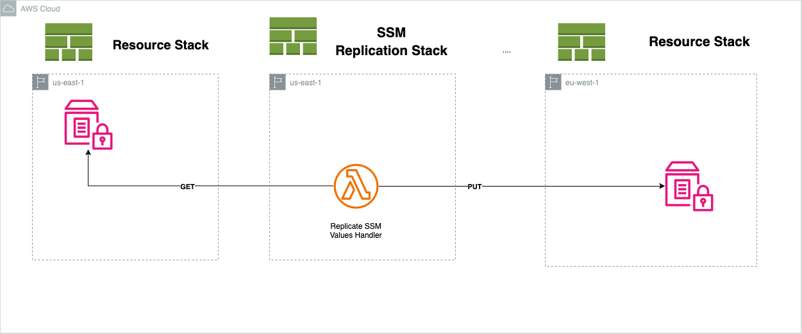

# AWS Parameter Store Cross-Region Replication

AWS Systems Manager's Parameter Store doesn't provide built-in cross-region replication for parameter values. However, you can implement a custom solution to achieve this.

___

One approach is to use AWS Lambda functions in conjunction with AWS SDK to retrieve parameter values from one region and then store or update them in another region's Parameter Store. Here's a high-level outline of how you could implement this:

 

1. Let's say we have a CloudFormation stack in the **us-east-1** region where some resources and parameter store values are created.
2. Then we will define another stack with a [AWS Custom Resource](https://docs.aws.amazon.com/AWSCloudFormation/latest/UserGuide/template-custom-resources.html) using [AWS Lambda](https://docs.aws.amazon.com/lambda/) under the hood. The stack will be responsible for coping  Parameter Store values from **us-east-1** to **eu-west-1** on each stack deployment.
3. And the third stack in the **eu-west-1** region  which will use previously created variables, but already in the current region.


___

### How To Build and Deploy
1. Nodejs should be installed(Directly on using NVM).
2. [Install AWS CDK](https://docs.aws.amazon.com/cdk/v2/guide/getting_started.html) and configure programmatic access. Because it's used to build the infrastructure.
3. Install dependencies: ```npm install```
4. Provide your aws account in the **infra/index.ts** file
5. Build infrastructure: ```npm run build```
6. And finally deploy: ```npm run deploy```

___

> Despite **us-east-1** and **eu-west-1** are used in the stacks you can use any regions.

> SSM Replication infrastructure can lay in  the first or third stack. It's divided for clarity.